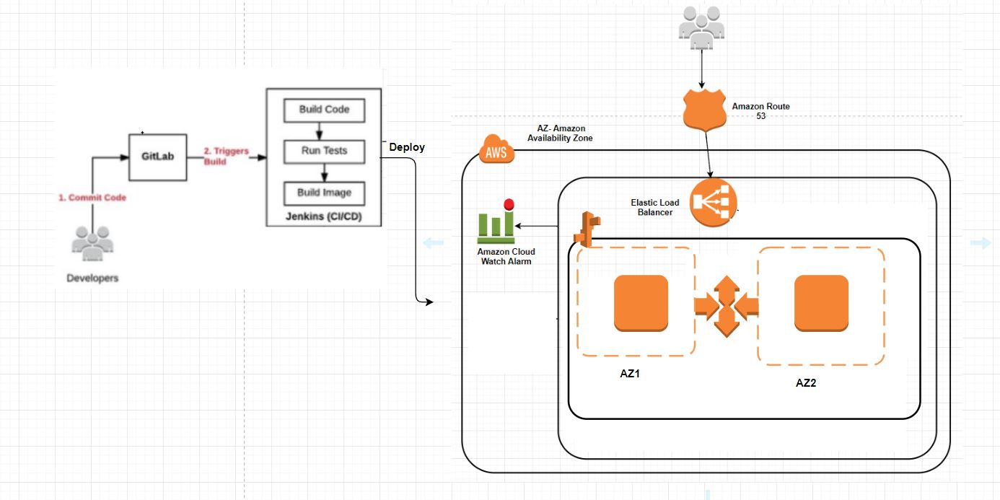
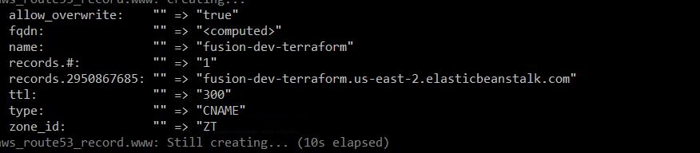

## Deployment Architecture



### KeyNote
In [beanstalk.tf](deploy-templates/dev/beanstalk.tf) put your terraform.tfstate file (infra state- for importing vpc id and subnets) path.

```
data "terraform_remote_state" "infra" {
    backend = "local"
    config {
        path = "S3 location where your infrastructure's terraform.tfstate is present"
    }
}
```

### Keywords

1.Elastic beanstalk
With Elastic Beanstalk, you can quickly deploy and manage applications in the AWS Cloud without worrying about the infrastructure that runs those applications.
AWS Elastic Beanstalk reduces management complexity without restricting choice or control.
You simply upload your application, and Elastic Beanstalk automatically handles the details of capacity provisioning, load balancing, scaling, and application health monitoring.

**.ebextension**
This is the required folder where all the configuration file will be placed.

I have placed [01-ec2userautorizedkeys.config](.ebextensions/01-ec2userautorizedkeys.config) which include few container command
thats helps us to insert the public key into the instances.
**authorized_keys.new** this file contains all the public key, say you want to give access to only 3 people then you can include there
public key so that all of them can access via there own key instead of circulating the single among each other. 

```
ssh-rsa AAAAB3NzaC1yc2EAAAABJQAAAQEAp1JwI8xzEt9tH6yLQB4zNL7E6hlRj2qycR9qDFbKPX1fk38HP+JYd0e6NYrekS4uRio/FG+Nuy5gYHkM2QS9MQg8nNQGTF/OSJ8tpwcKH4/kEN5RFPEPGo/3475/N6UXxp4Jhz0ASRxSMDLMWrKaG+TcA+3Pnm6hMcb+15/v1Ed7E1KZ6Dzw9gTQ+moomEg9OYpG2PlGa332snz/JC1U3DH+IgDPGAGAxzeiL394WMm/+VHwASrupun9d08nVbK0k2+0hza1p2HQ0XKXqX4tg/pKUz+0ypAJ1t0n6XSowowqbjyWPvtMXGb98SJC9iUvP18EqJzd//MKk5+ZWiww== key1
ssh-rsa AAAAB3NzaC1yc2EAAAABJQAAAQEAp1JwI8xzf4Et9tH6yLQB4zNL7E6hlRj2qycR9qDFbKPX1fk38HP+JYd0e6NYrekS4uRio/FG+Nuy5gYHkM2QS9MQg8nNQGTF/OSJ8tpwcKH4/kEN5RFPEPGo/3475/N6UXxp4Jhz0ASRxSMDLMWrKaG+TcA+3Pnm6hMcb+15/v1Ed7E1KZ6Dzw9gTQ+moomEg9OYpG2PlGa332snz/JC1U3DH+IgDPGAGAxzeiL394WMm/+VHwASru9d08nVbK0k2+0hza1p2HQ0XKXqX4tg/pKUz+0ypAJ1t0n6XSowowqbjyWPvtMXGb98SJC9iUvP18EqJzd//MKk5+ZWiww== key2

```

2.Dockerfile
As container is a standard unit of software that packages up code and all its dependencies so the application runs quickly and reliably from one computing environment to another.
So I have written a Dockerfile with base image **hashicorp/http-echo** and specified the required command **-text="Hello" for displaying the message on browser.

3.deploy-template
This folder includes the IAC for creating beanstalk. Depending on the type of environment where you want to deploy you can use the IAC.

4.Route53
This file performs the DNS routing.
NOTE
>you have to mention your HostedZone ID



5.CI/CD
For deploying the application to Elastic Beanstalk you can use the jenkins server. 
For creating [Jenkins-server](https://github.com/karan6190/Infra-provisioning) you can ref to my Infrastructure Provisioning code.

Jenkis will be setup with install terraform and AWS cli. So without using any plug-in you can checkout the git-code or create the web-hook 
and writes the code into the build (linux shell) step:-

```
export AWS_ACCESS_KEY_ID=${AWS_ACCESS_KEY_ID}
export AWS_SECRET_ACCESS_KEY=${AWS_SECRET_ACCESS_KEY}
terraform init
terraform apply -auto-approve
zip -r9 artifacts.zip ./ -x *.git* *.module* .doc* deploy-template/\*
#ApplicationName- mention your beanstalk application name
eb use ApplicationName -v
eb setenv AWS_ACCESS_KEY_ID=${AWS_ACCESS_KEY_ID} AWS_SECRET_ACCESS_KEY=${AWS_SECRET_ACCESS_KEY}
eb deploy ApplicationName -v

```

